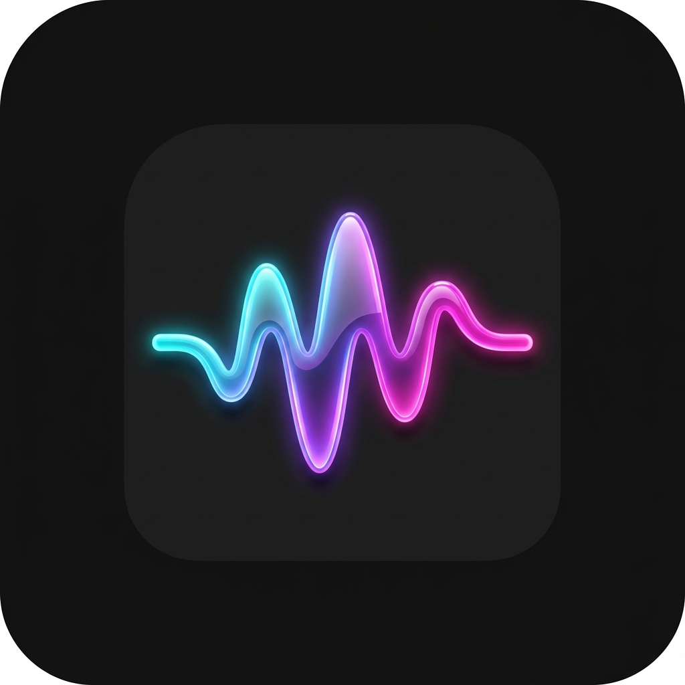
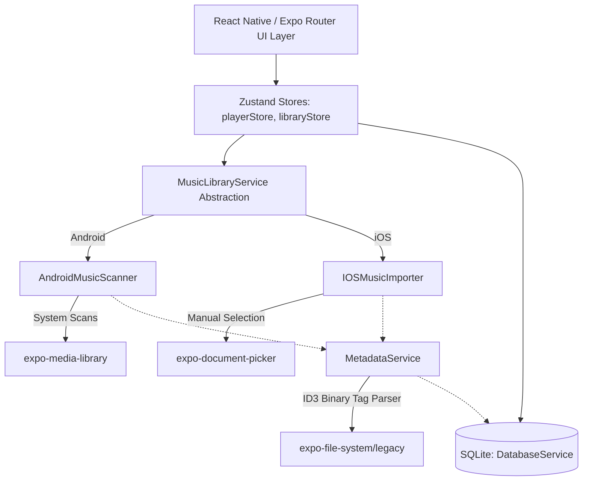

<p align="center">
  
</p>

<h1 align="center">Waveform</h1>

<p align="center">
  <a href="https://docs.expo.dev/versions/v57.0.0/"></a>
  <a href="https://reactnative.dev/"></a>
  <a href="https://sqlite.org/"></a>
  <a href="LICENSE"></a>
  <a href="#platform-support"></a>
</p>


Waveform is a premium, fully offline music player designed for modern audiophiles. Built with **React Native** and **Expo SDK 57**, it features a dark glassmorphic design language, smooth gesture controls, an animated waveform visualizer, mood-based playlists, and background playback via Expo's new first-party audio API.

---

## 📱 Platform Support & Core Integration

Because Waveform is built around local media and native device storage APIs, the scanning experience is optimized per platform:

| Feature | Android | iOS | Technical Driver |
| :--- | :---: | :---: | :--- |
| **Auto-Scan Audio Library** | ✅ | — | `expo-media-library` (background polling & system broadcast listener) |
| **Manual File Import** | — | ✅ | `expo-document-picker` (sandboxed file importer) |
| **Background Playback** | ✅ | ✅ | `expo-audio` (native OS audio focus controls) |
| **Lock Screen Controls** | ✅ | ✅ | OS-level media control center binding |
| **Haptic Feedback** | ✅ | ✅ | `expo-haptics` for tactile seeking and actions |
| **SQLite Caching** | ✅ | ✅ | `expo-sqlite` persistent schema manager |

---

## 🛠️ System Architecture

Waveform decouples the UI layout from native playback and file system storage using a structured service-oriented layer:



---

## ✨ Standout Features

### 🎨 Deterministic Dynamic Themes
Waveform features color styling that morphs dynamically with the playing track. Instead of heavy, slow native image analysis on artwork, the app computes a **deterministic accent color** by hashing the track's URI. This generates a stable, vibrant HSL color palette tailored to each song, rendering custom gradients, shadows, and slider tracks instantly.

### 📊 Animated Waveform Equalizer
The player view features a custom-designed, react-native-reanimated bar visualizer. It displays 24 smooth, sine-curved bars that pulse dynamically to the rhythm when music is playing. On pause, the animation eases gently back to a flatline configuration.

### 🧠 Mood-Based Classification
Every time the local library is scanned, the `MetadataService` automatically categorizes tracks into mood playlists based on keyword heuristics found in metadata headers (title, artist, and album tags):
*   **Chill**: ambient, lofi, acoustic, relax, calm, sleep, slow, smooth.
*   **Focus**: instrumental, piano, classical, cinematic, brain, deep.
*   **Workout**: workout, energy, rock, metal, edm, dance, electronic, trap.

### 🕰️ Rediscover Carousel
Waveform queries the local database to find hidden gems you haven't played in over 30 days (or have never played). These are compiled into a horizontal carousel on the library home page, promoting exploration of your existing music catalog.

### 😴 Volume-Fading Sleep Timer
Set a sleep timer (from 15 to 90 minutes). During the **last 30 seconds** of the countdown, the app initiates a linear volume fade-out before pausing playback.

---

## 🗄️ Database Schema Design

Waveform stores your music database locally in a persistent SQLite container (`waveform.db`) using writing-ahead logging (`WAL` mode) for maximum read/write performance.

```sql
PRAGMA journal_mode = WAL;

-- Track records, cached metadata, and statistics
CREATE TABLE IF NOT EXISTS tracks (
  id TEXT PRIMARY KEY,
  uri TEXT NOT NULL UNIQUE,
  filename TEXT NOT NULL,
  title TEXT NOT NULL,
  artist TEXT NOT NULL DEFAULT 'Unknown Artist',
  album TEXT NOT NULL DEFAULT 'Unknown Album',
  duration REAL NOT NULL DEFAULT 0,
  artworkUri TEXT,
  artworkColor TEXT,
  fileSize INTEGER NOT NULL DEFAULT 0,
  dateAdded INTEGER NOT NULL,
  lastPlayedAt INTEGER,
  playCount INTEGER NOT NULL DEFAULT 0,
  isFavorite INTEGER NOT NULL DEFAULT 0,
  mood TEXT,
  bpmEstimate REAL
);

-- Playlist containers
CREATE TABLE IF NOT EXISTS playlists (
  id TEXT PRIMARY KEY,
  name TEXT NOT NULL,
  description TEXT,
  artworkUri TEXT,
  isAuto INTEGER NOT NULL DEFAULT 0,
  mood TEXT,
  createdAt INTEGER NOT NULL,
  updatedAt INTEGER NOT NULL
);

-- Many-to-many playlist membership
CREATE TABLE IF NOT EXISTS playlist_tracks (
  playlistId TEXT NOT NULL,
  trackId TEXT NOT NULL,
  position INTEGER NOT NULL DEFAULT 0,
  PRIMARY KEY (playlistId, trackId),
  FOREIGN KEY (playlistId) REFERENCES playlists(id) ON DELETE CASCADE,
  FOREIGN KEY (trackId) REFERENCES tracks(id) ON DELETE CASCADE
);

-- Key-value stores for application state
CREATE TABLE IF NOT EXISTS metadata (
  key TEXT PRIMARY KEY,
  value TEXT NOT NULL
);

-- Query optimizations indices
CREATE INDEX IF NOT EXISTS idx_tracks_artist ON tracks(artist);
CREATE INDEX IF NOT EXISTS idx_tracks_album ON tracks(album);
CREATE INDEX IF NOT EXISTS idx_tracks_lastPlayedAt ON tracks(lastPlayedAt);
CREATE INDEX IF NOT EXISTS idx_tracks_isFavorite ON tracks(isFavorite);
CREATE INDEX IF NOT EXISTS idx_tracks_mood ON tracks(mood);
```

---

## 📂 Project Structure

```
waveform/
├── app/                        # Expo Router Layouts & Routing
│   ├── _layout.tsx             # Root Provider wrapper (fonts, db, audio init)
│   ├── player-modal.tsx        # Glassmorphic full-screen player sheet
│   └── (tabs)/                 # Bottom navigation tabs
│       ├── _layout.tsx         # Blurry Tab Bar setup
│       ├── index.tsx           # Library Home, Rediscover, & Mood lists
│       ├── playlists.tsx       # Custom user playlist manager
│       ├── search.tsx          # Real-time search with fuzzy queries
│       └── now-playing.tsx     # Current queue manager + sleep timer panel
│
└── src/                        # Core codebase
    ├── components/             # Reusable UI Blocks
    │   ├── AlbumArt.tsx        # Shared element artwork view
    │   ├── FullPlayer.tsx      # Main music player interface
    │   ├── MiniPlayer.tsx      # Floating bottom-bar persistent controls
    │   ├── SeekBar.tsx         # Gesture-responder slider
    │   ├── SleepTimerModal.tsx # Bottom-sheet timer with options grid
    │   ├── SongCard.tsx        # Compact song item list render
    │   └── WaveformVisualizer.tsx # Dynamic pulsating Reanimated bar visualizer
    ├── hooks/                  # Custom React hooks
    │   ├── useAccentColor.ts   # Derives vibrant colors from hashes
    │   └── usePlayer.ts        # Bridges Zustand state with expo-audio events
    ├── services/               # Device & Native APIs Integrations
    │   ├── DatabaseService.ts  # SQLite query interface
    │   ├── AndroidMusicScanner.ts # Background media library scanner
    │   ├── IOSMusicImporter.ts # iOS sandboxed file loader
    │   ├── MusicLibraryService.ts # Unified platform-agnostic facade
    │   └── MetadataService.ts  # Streamed ID3v2 parser (loads first 10KB of file)
    ├── store/                  # State containers
    │   ├── libraryStore.ts     # Library states, listings, & database syncs
    │   └── playerStore.ts      # Tracks, indices, queues, loop states, & sleep timers
    ├── theme/                  # Aesthetics definition
    │   ├── colors.ts           # Glassmorphism tokens & dark colors
    │   └── typography.ts       # Custom Google font (Outfit) styles
    └── types/                  # Typescript specifications
```

---

## 🚀 Getting Started

### Prerequisites
*   [Node.js](https://nodejs.org/) (Version 18 or above recommended)
*   **Android Development**: [Android Studio](https://developer.android.com/studio) & Android SDK configured.
*   **iOS Development**: [Xcode](https://developer.apple.com/xcode/) 15+ (macOS only) & CocoaPods installed.

> [!IMPORTANT]
> **Expo Go is not supported**: This application relies heavily on native APIs (`expo-audio`, `expo-sqlite`, `expo-media-library`, and `expo-haptics`). You must run this project within a **development client build**.

### Local Setup
1.  **Clone the repository & install dependencies**
    ```bash
    git clone https://github.com/MJ-Meet/Waveform.git
    cd Waveform
    npm install
    ```
2.  **Generate native build folders**
    ```bash
    npx expo prebuild
    ```
3.  **Run on a Physical Device or Simulator**
    *   **Android (Dev Build)**:
        ```bash
        npm run android
        ```
    *   **iOS (Dev Build)**:
        ```bash
        npm run ios
        ```

---

## 📦 Building for Production

This project is pre-configured for production builds using [Expo Application Services (EAS)](https://expo.dev/eas).

1.  **Install EAS CLI and Authenticate**
    ```bash
    npm install -g eas-cli
    eas login
    ```
2.  **Trigger Native Cloud Builds**
    *   **Android Build (APK / AAB)**:
        ```bash
        eas build --platform android --profile production
        ```
    *   **iOS Build (IPA)**:
        ```bash
        eas build --platform ios --profile production
        ```

---

## 📜 License

Distributed under the MIT License. See [LICENSE](LICENSE) for more information.